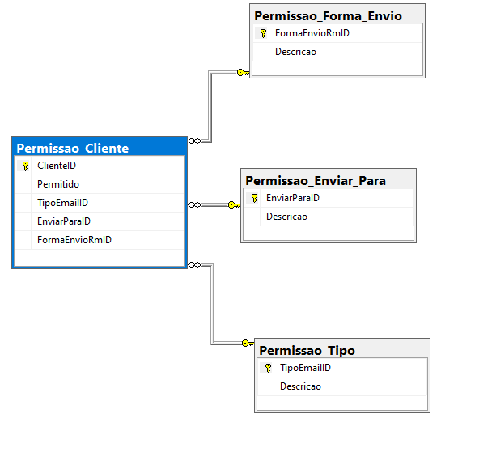

# Desafio Técnico AZ Guidance

Diagrama do Banco de dados:



> O projeto teve como foco estruturar um banco de dados relacional para consulta de clientes e alteração de seus status de envio de e-mail. Após isso deve-se apresentar os dados populados disponíveis para a busca a partir do ID do usuário. Então, se necessário deve ser possível alterar tais dados.

### Ajustes e melhorias

O projeto ainda está em desenvolvimento e as próximas atualizações serão voltadas para as seguintes tarefas:

- [x] Banco de dados relacional - Concluído
- [x] API - Concluído
- [x] Blazor pages - Concluído
- [ ] Melhorar o Layout das telas
- [ ] Aprimorar a segurança dos dados

## 💻 Pré-requisitos

Antes de começar, verifique se você atendeu aos seguintes requisitos:

- Você instalou a versão mais recente de `<.Net SDK / C# e Blazor / SQL Server>`
- Você tem uma máquina `<Windows>`.

## 🚀 Instalando <Desafio Técnico AZ Guidance>

Para executar o <Desafio Técnico AZ Guidance>, siga estas etapas:

Windows:

Instale o SDK .Net e o SQL Server.

Execute os Scripts do SQL como informado no arquivo ScriptsSQL.sql. Assim o banco será populado com sucesso.

## ☕ Usando <Desafio Técnico AZ Guidance>

Para executar o projeto <Desafio Técnico AZ Guidance>, siga estas etapas:

Para executar a API navegue para a pasta "DesafioTecnicoAPI" e execute os comandos:

```

<dotnet restore>
```

e em seguida

```
<dotnet run>
```

Para executar o Blazor navegue para a pasta "DesafioTecnicoBlazor" e execute os comandos:

```
<dotnet restore>
```

e em seguida

```
<dotnet run>
```

## 📫 Contribuindo para o <Desafio Técnico AZ Guidance>

Para contribuir com <Desafio Técnico AZ Guidance>, siga estas etapas:

1. Faça um fork este repositório.
2. Crie um branch: `git checkout -b <nome_branch>`.
3. Faça suas alterações e confirme-as: `git commit -m '<mensagem_commit>'`
4. Envie para o branch original: `git push origin <nome_do_projeto> / <local>`
5. Crie a solicitação de pull.

Como alternativa, consulte a documentação do GitHub em [como criar uma solicitação pull](https://help.github.com/en/github/collaborating-with-issues-and-pull-requests/creating-a-pull-request).

## 🤝 Colaboradores

Primeiramente agradeço a oportunidade de fazer parte desse processo seletivo. Essa foi uma ótima oportunidade de colocar meus conhecimentos em prática.

Para mais contato:

<table>
  <tr>
    <td align="center">
      <a href="#" title="[Leandro I. S.](https://www.linkedin.com/in/leandro-izidoro-a5143471/)">
        <br>
        <sub>
          <b>Leandro I. S.</b>
        </sub>
      </a>
    </td>
  </tr>
</table>

Saudações à equipe AZ Guidance que me guiou até aqui.

## 😄 Seja um dos contribuidores

## 📝 Créditos

Todos os créditos estão reservados à AZ Guidance.
